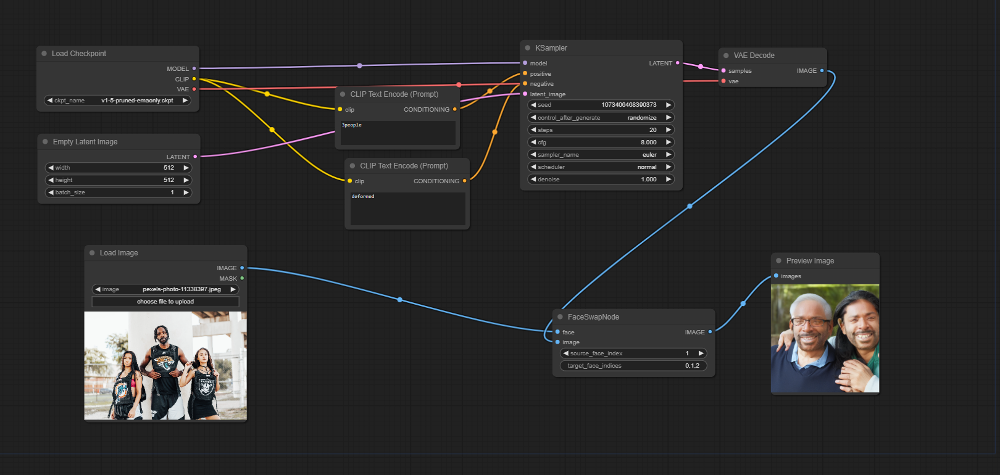

# ComfyUI-FaceSwap
Very basic custom node to enable face swapping in ComfyUI. Only runs on CPU at the moment. GPU support will come later. Mostly a direct port from the excellent a1111 plugin: https://github.com/s0md3v/sd-webui-roop.
At the moment Insightface have only released the 128x128 model so the results can be a bit janky at large res. Hopefully they release their bigger res models soon. Use at your own discretion, i am not responsible for what you create with this.

# Installation

cd <comfyui_root>/custom_nodes/
git clone https://github.com/imb101/ComfyUI-FaceSwap
re-start comfyui and it should install all the bits to work

# Usage

Add a FaceSwapNode, give it an image of a face(s) and an image to swap the face into. Pick which source face you want to use and then which faces to replace(index starts from 0 and is comma seperated). You can chain the nodes to replace multiple faces in a scene. Sample workflows are in the repo.

